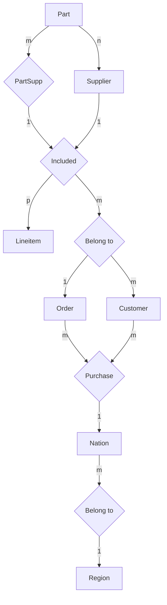

# 数据库原理及应用实验

实验指导老师：严丹丹、唐颖

课程名称：数据库原理及应用 2024/2025 学年第 2 学期 使用班级 23 级网络工程

<table><tr><td rowspan="2">序号</td><td rowspan="2">教学内容</td><td colspan="3">教学时数</td><td rowspan="2">教学手段</td><td rowspan="2">对应章节</td><td rowspan="2">备注</td></tr><tr><td>讲课</td><td>习题</td><td>实验</td></tr><tr><td>1</td><td>实验一:数据库运行环境</td><td></td><td></td><td>2</td><td>实验</td><td>第1章</td><td></td></tr><tr><td>2</td><td>实验二:数据库设计</td><td></td><td></td><td>2</td><td>实验</td><td>第7章</td><td></td></tr><tr><td>3</td><td>实验三:数据库的创建及管理</td><td></td><td></td><td>2</td><td>实验</td><td>第3章</td><td>实验3.1实验5.1-5.3</td></tr><tr><td>4</td><td>实验四:数据检索</td><td></td><td></td><td>2</td><td>实验</td><td>第3章</td><td>实验3.2</td></tr><tr><td>5</td><td>实验五:高级数据检索</td><td></td><td></td><td>2</td><td>实验</td><td>第3章</td><td>实验3.3</td></tr><tr><td>6</td><td>实验六:数据更新</td><td></td><td></td><td>2</td><td>实验</td><td>第3章</td><td>实验3.4</td></tr><tr><td>7</td><td>实验七:视图</td><td></td><td></td><td>2</td><td>实验</td><td>第3章</td><td>实验3.5</td></tr><tr><td>8</td><td>实验八:数据安全性、完整性</td><td></td><td></td><td>2</td><td>实验</td><td>第4章第5章</td><td>实验4.1实验5.4</td></tr><tr><td></td><td></td><td></td><td></td><td>16</td><td></td><td></td><td></td></tr><tr><td></td><td></td><td colspan="6">合计:16</td></tr></table>

# 实验一：数据库运行环境

# 可选择的数据库:

# 一、人大金仓：

1. 在人大金仓公司网站（http://www.kingbase.com.cn）上找到金仓数据库产品下载链接（https://download.kingbase.com.cn/xzzx/index.htm）下载并安装人大金仓数据库。下载安装 KingbaseES V9. 和 license。  
2.Kinbase 使用简介

https://www.bilibili.com/video/BV1mM411H7eH/?spm\_id\_from=333.337.search-card.all.click&vd\_source=bd87fb3a5640b5a4c136048ea351671d

3. 新建连接 Kingbase, 创建数据库 PSS, 创建模式 sales, 设置当前会话的搜索路径为 sales 模式, 表会自动创建在 sales 模式下。

# 安装注意事项：


<details>
<summary>text_image</summary>

KingbaseES V8 安装程序
选择安装集
✓ 简介
✓ 许可协议
○ 选择安装集
○ 选择安装文件夹
○ 预安装摘要
○ 添加功能
○ 选择安装集
○ 正在安装...
○ 选择文件夹
○ 获取用户输入
○ 安装完成
完全安装
系统将安装最常用的应用程序功能部件。建议大多数用户采用此选项。
客户端安装
只安装需要的应用程序功能部件。仅建议磁盘可用空间有限的用户采用此选项。
○ 定制安装
选择此选项以定制要安装的功能部件。
InstallAnywhere
取消
上一步(P)
下一步(N)
</details>

授权文件导入，导入之前我们下载好的授权文件（license\_.dat）


# KingbaseES V8 安装程序


√ 简介  
√ 许可协议  
选择安装集  
选择安装文件夹  
预安装摘要   
… 添加功能  
选择安装集  
正在安装...  
选择文件夹  
获取用户输入  
… 安装完成

<table><tr><td colspan="3">E:\license_12350_0.dat</td><td>选择授权文件</td></tr><tr><td>属性</td><td>启用</td><td>版本</td><td></td></tr><tr><td>License序列号</td><td>启用</td><td>74FE7946-4378-1...</td><td></td></tr><tr><td>生产日期</td><td>启用</td><td>2021-11-12</td><td></td></tr><tr><td>产品名称</td><td>启用</td><td>KingbaseES V8</td><td></td></tr><tr><td>细分版本模板名</td><td>启用</td><td>SALES-开发版 V8R6</td><td></td></tr><tr><td>产品版本号</td><td>启用</td><td>V008R006C</td><td></td></tr><tr><td>浮动基准日期</td><td>启用</td><td></td><td></td></tr><tr><td>有效期间</td><td>启用</td><td>0</td><td></td></tr><tr><td>用户名称</td><td>启用</td><td>官方网站试用授权</td><td></td></tr><tr><td>项目名称</td><td>启用</td><td>官方网站试用授权</td><td></td></tr><tr><td>CPU检查</td><td>启用</td><td>0</td><td></td></tr><tr><td>容器名称</td><td>禁用</td><td>0</td><td></td></tr><tr><td>MAC地址</td><td>启用</td><td>00:00:00:00:00:00</td><td></td></tr><tr><td>最大连接数</td><td>启用</td><td>10</td><td></td></tr><tr><td>分区</td><td>启用</td><td>0</td><td></td></tr></table>

InstallAnywhere

取消


<details>
<summary>text_image</summary>

产品与方案
生态合作
兼容适配
金仓社区
关于我们
授权文件
下载
license_标准版.zip
打开文件
KingbaseES_V008R006C007B0012
打开文件
KingbaseES V8 安装程序
文件
主页
共享
查看
选择授权文件
查找
license_29403
最近使...
桌面
文档
此电脑
网络
文件名
文件类型 .dat
打开
取消
在 Kingbase 中搜索
修改日期
2023/3/16 10:48
2022/10/29 15:50
2023/3/18 10:02
2023/3/18 9:57
2022/10/29 15:58
2022/10/29 15:58
InstallAnywhere
</details>


<details>
<summary>text_image</summary>

KingbaseES V8 安装程序
初始化数据库参数
✓ 简介
✓ 许可协议
✓ 选择安装集
✓ 选择安装文件夹
✓ 预安装摘要
✓ 添加功能
✓ 选择安装集
✓ 正在安装...
✓ 选择文件夹
获取用户输入
安装完成
请输入信息用于初始化数据库：
请输入数据库端口号、用户名和密码，选择数据库字符集、兼容模式、是否大小写敏感和存储块大小。
建议默认
数据库服务端口号：
54321
数据库管理员用户名：
system
数据库管理员密码：
****
再次输入数据库管理员密码：
输入密码后要记住，
后面要输入
InstallAnywhere
取消
上一步(P)
完成(D)
</details>

过程中会跳出一些 c++ 的支持库需要手动确认安装，下一步下一步就好，点下 close 或者 repair 都行。

# 二、Sql-sever

1. sqlsever developer 版本的下载地址:

https://www.microsoft.com/zh-cn/sql-server/sql-server-downloads

下载完后还需要下载工具 ssms:

https://learn.microsoft.com/zh-cn/ssms/download-sql-server-management-studio-ssms

安装注意事项:

可以选基本，也可以选自定义

SQL Server 2022


# Developer Edition

选择安装类型:

# 基本(B)

选择"基本"安装类型可以安装带默认配置的 SQL Server 数据库引擎功能。

# 自定义(C)

选择"自定义"安装类型可以逐步完成 SQL Server 安装向导，并选择要安装的内容。由于这种安装类型是详细安装，因此耗时比运行"基本"安装更长。

# 下载介质(D)

立即下载 SQL Server 安装程序文件，稍后在选定计算机上进行安装。

为了有助于改进产品，SQL Server 会向 Microsoft 传输安装体验相关信息，以及其他使用情况和性能数据。若要详细了解数据处理和隐私控制，以及如何在安装后禁止收集此类信息，请参阅文档


<details>
<summary>text_image</summary>

SQL Server 安装中心
计划
维护
工具
资源
高级
选项
Microsoft SQL Server 2022
1
2
全新 SQL Server 独立安装或向现有安装添加功能
启动向导，在非群集环境中安装 SQL Server 2022，或向现有的 SQL Server 2022 实例添加功能。
安装 SQL Server Reporting Services
启动可提供链接的下载页面以安装 SQL Server Reporting Services。安装 SSRS 需要 Internet 连接。
安装 SQL Server 管理工具
启动提供了安装 SQL Server Management Studio、SQL Server 命令行实用程序 (SQLCMD 和 BCP)、SQL Server PowerShell 提供程序、SQL Server Profiler 和数据库优化顾问的链接的下载页。必须具有内部连接才能安装这些工具。
安装 SQL Server 数据工具
打开包含 SQL Server Data Tools (SSDT) 安装链接的下载页。SSDT 提供 Visual Studio 集成，包括对 Microsoft Azure SQL 数据库、SQL Server 数据库引擎、Reporting Services、Analysis Services 和 Integration Services 的项目系统支持。必须连接到互联网，才能安装 SSDT。
新的 SQL Server 故障转移群集安装
启动向导，安装单节点 SQL Server 2022 故障转移群集。
此操作仅适用于群集环境。
向 SQL Server 故障转移群集添加节点
启动向导，向现有的 SQL Server 2022 故障转移群集添加节点。
此操作仅适用于群集环境。
从 SQL Server 早期版本升级
</details>


<details>
<summary>text_image</summary>

SQL Server 2022 安装
版本
选择要安装的 SQL Server 2022 版本。
版本
许可条款
全局规则
Microsoft 更新
产品更新
安装安装程序文件
安装规则
适用于 SQL Server 的 Azure ...
功能选择
功能规则
功能配置规则
准备安装
安装进度
完成
选择要安装的 SQL Server 版本。你可以选择使用通过输入产品密钥购买的 SQL Server 许可证，也可以通过 Microsoft Azure 选择即用即付计费。你也可以指定 SQL Server 的免费版本: Developer、Evaluation 或 Express。如 SQL Server 联机丛书中所述，Evaluation 版包含最大的 SQL Server 功能集，不但已激活，还具有 180 天的有效期。Developer 版永不过期，并且包含与 Evaluation 版相同的功能集，但仅许可进行非生产数据库应用程序开发。若要从一个已安装的版本升级到另一个版本，请运行版本升级向导。
● 指定可用版本(S):
Developer
○ 通过 Microsoft Azure 使用即用即付计费(U):
警告：若要启用此选项，必须拥有活动的 Azure 订阅，你需要在稍后的设置中提供该订阅以及资源组、Azure 区域和租户 ID。如需了解信息，请参阅 https://aka.ms/ArcEnabledSqlPAYG。
标准
○ 输入产品密钥(E):
- - - -
□ 我拥有包含软件保障的 SQL Server 许可证或 SQL 软件订阅
□ 我只有 SQL Server 许可证
</details>


<details>
<summary>text_image</summary>

SQL Server 2022 安装
Microsoft 更新
使用 Microsoft 更新检查重要更新
版本
许可条款
全局规则
Microsoft 更新
产品更新
安装安装程序文件
安装规则
Microsoft 更新为 Windows 以及包括 SQL Server 2022 在内的其他 Microsoft 软件提供安全更新程序和其他重要的更新程序。可以使用“自动更新”获得更新程序，也可以访问 Microsoft 更新网站。
□ 使用 Microsoft 更新检查更新(推荐)(M)
建议不选
Microsoft 更新常见问题
Microsoft 隐私声明
</details>


<details>
<summary>text_image</summary>

适用于 SQL Server 的 Azure 扩展
要启用 Microsoft Defender for Cloud、Purview 和 Azure Active Directory，需要适用于 SQL Server 的 Azure 扩展。

版本
□ 适用于 SQL Server 的 Azure
若要安装适用于 SQL Server 的 Azure 扩展，请提供 Azure 帐户或服务主体，以便向 Azure 验证 SQL Server 实例。还需要提供订阅 ID、资源组、区域和租户 ID，以便在其中注册此实例。有关每个参数的详细信息，请访问 https://aka.ms/arc-sql-server。
许可条款
Microsoft 更新
产品更新
安装安装程序文件
安装规则
适用于 SQL Server 的 Azure ...
这里原本是选中的，需要手动取消掉之后点击下一步
使用 Azure 登录名
使用服务主体
Azure 服务主体 ID*
</details>

实例可选默认，也可命名

# 实例配置

指定 SQL Server 实例的名称和实例 ID。实例 ID 将成为安装路径的一部分。

安装规则

功能选择

功能规则

实例配置

服务器配置

数据库引擎配置

Analysis Services 配置

功能配置规则

准备安装

安装进度

完成

# - 默认实例(D)

○ 命名实例(A):

MSSQLSERVER

实例 ID(1):

MSSQLSERVER

SQL Server 目录:

C:\Program Files\Microsoft SQL Server\MSSQL15.MSSQLSERVER

Analysis Services 目录: C:\Program Files\Microsoft SQL Server\MSAS15.MSSQLSERVER

已安装的实例(L):

<table><tr><td>实例名称</td><td>实例 ID</td><td>功能</td><td>版本类别</td><td>版本</td></tr><tr><td></td><td></td><td></td><td></td><td></td></tr></table>

<上一步(B)

下一步(N) >

取消


SQL Server 2019 安装


# 服务器配置

指定服务帐户和排序规则配置。

安装规则

功能选择

功能规则

实例配置

服务器配置

数据库引擎配置

Analysis Services 配置

功能配置规则

准备安装

安装进度

完成

服务帐户 排序规则

Microsoft 建议您对每个 SQL Server 服务使用一个单独的帐户(M)。

最好改成自动

<table><tr><td>服务</td><td>帐户名</td><td>密码</td><td colspan="2">启动类型</td></tr><tr><td>SQL Server 代理</td><td>NT Service\SQLSERVE...</td><td></td><td>手动</td><td>√</td></tr><tr><td>SQL Server 数据库引擎</td><td>NT Service\MSSQLSE...</td><td></td><td>自动</td><td>√</td></tr><tr><td>SQL Server Analysis Services</td><td>NT Service\MSSQLSer...</td><td></td><td>自动</td><td>√</td></tr><tr><td>SQL Server Integration Service...</td><td>NT Service\MsDtsServ...</td><td></td><td>自动</td><td>√</td></tr><tr><td>SQL 全文筛选器后台程序启动器</td><td>NT Service\MSSQLFD...</td><td></td><td>手动</td><td></td></tr><tr><td>SQL Server Browser</td><td>NT AUTHORITY\LOCA...</td><td></td><td>已禁用</td><td>√</td></tr></table>

□授予 SQL Server 数据库引擎服务“执行卷维护任务”特权(G)

此特权可以通过避免数据页清零来启用即时文件初始化。这可能会因允许访问删除的内容而导致信息泄漏。

单击此处了解详细信息


SQL Server 2019 安装


# 数据库引擎配置

指定数据库引擎身份验证安全模式、管理员、数据目录、TempDB、最大并行度、内存限制和文件流设置。

安装规则

功能选择

功能规则

实例配置

服务器配置

数据库引擎配置

Analysis Services 配置

功能配置规则

准备安装

安装进度

完成

服务器配置 数据目录 TempDB MaxDOP 内存 FILESTREAM

为数据库引擎指定身份验证模式和管理员。

身份验证模式

○ Windows 身份验证模式(W)

1 混合模式(SQL Server 身份验证和 Windows 身份验证)(M) 注意此时用户名是ca

为 SQL Server 系统管理员(sa)帐户指定密码。

输入密码(E): ●●●●●●●●●●

确认密码(○): ●●●●●●●●●●

指定 SQL Server 管理员

LICHUNFENG1023\Administrator (Administrator)

SQL Server 管理员对数据库引擎具有无限制的访问权限。

添加当前用户(C) 添加(A)... 删除(R)


SQL Server 2019 安装


# Analysis Services 配置

指定 Analysis Services 服务器模式、管理员和数据目录。

安装规则

功能选择

功能规则

实例配置

服务器配置

数据库引擎配置

Analysis Services 配置

功能配置规则

准备安装

安装进度

完成

服务器配置 数据目录

服务器模式:

○ 多维和数据挖掘模式(M)

表格模式(I)

PowerPivot 模式(P)

指定哪些用户具有对 Analysis Services 的管理权限。

LICHUNFENG1023\Administrator (Administrator)

Analysis Services 管理员对

Analysis Services 具有不受限制的访问权限。

添加当前用户(C) 添加(A)... 删除(R)

上一步(B) 下一步(N)

取消

然后安装 SSMS。

# 三、Mysql:

官网下载地址：https://www.mysql.com/downloads/

安装注意事项：


<details>
<summary>text_image</summary>

MySQL. Installer
Adding Community
Choosing a Setup Type
Select Products
Download
Installation
Installation Complete
Choosing a Setup Type
Please select the Setup Type that suits your use case.
Developer Default 默认：开发者模式
Installs all products needed for MySQL development purposes.
Server only 作为服务器
Installs only the MySQL Server product.
Client only 作为客户端
Installs only the MySQL Client products, without a server.
Full 都包含的
Installs all included MySQL products and features.
Custom 自定义
Manually select the products that should be installed on the system.
</details>


<details>
<summary>text_image</summary>

MySQL Installer
Adding Community
Choosing a Setup Type
Select Products
Check Requirements
Installation
Product Configuration
Installation Complete
Select Products
Please select the products you would like to install on this computer.
Filter:
All Software,Current Bundle,Any
Edit
Available Products:
MySQL Servers
MySQL Server
MySQL Server 8.0
MySQL Server 8.0.30 - X64
Applications
MySQL Connectors
Documentation
Products To Be Installed:
MySQL Server 8.0.30 - X64
Enable the Select Features page to
customize product features
Published: N/A
Release Notes: https://dev.mysql.com/doc/relnotes/mysql/8.0/en/news-8-0-30.html
< Back	Next >	Cancel
</details>

选择安装路径以及数据库存放路径:


<details>
<summary>text_image</summary>

MySQL Installer
Adding Community
Choosing a Setup Type
Select Products
Check Requirements
Installation
Product Configuration
Installation Complete
Select Products
Please select the products you would like to install on this computer.
Filter:
All Software, Current Bundle, Any
Edit
Available Products:
MySQL Servers
Applications
MySQL Connectors
Documentation
Products To Be Installed:
MySQL Server 8.0.30 - X64
Enable the Select Features page to
customize product features
Advanced Options
Published: N/A
Release Notes: https://dev.mysql.com/doc/reinotes/mysql/8.0/en/news-8-0-30.html
</details>


<details>
<summary>text_image</summary>

Advanced Options for MySQL Server 8.0.30
Install Directory: 安装位置
D:\MySQL\MySQL Server 8.0
Data Directory:
D:\MySQL\MySQL Data 数据库存放位置
</details>

配置 MySQL


MySQL Installer


<details>
<summary>text_image</summary>

MySQL. Installer
Adding Community

Choosing a Setup Type

Select Products

Check Requirements

Installation

Product Configuration

Installation Complete
</details>

# Product Configuration

We'll now walk through a configuration wizard for each of the following products.

You can cancel at any point if you wish to leave this wizard without configuring all the products.


<details>
<summary>text_image</summary>

Product
MySQL Server 8.0.30
Status
Ready to configure
</details>

配置安装类型和网络:

Development Computer: 占用比较少的内存资源

Server Computer: 占用中等程度的内存资源

Dedicated Computer: 以专门的数据库出现，占用比较多的内存资源


MySQL Installer


<details>
<summary>text_image</summary>

MySQL. Installer
MySQL Server 8.0.30
Type and Networking
Authentication Method
Accounts and Roles
Windows Service
Apply Configuration
</details>

# Type and Networking

Server Configuration Type

Choose the correct server configuration type for this MySQL Server installation. This setting will define how much system resources are assigned to the MySQL Server instance.


<details>
<summary>text_image</summary>

Config Type: Development Computer
Connectivity
Use the follow
TCP/IP
Name
Share
Advanced Con
Select the che
and logging o
Show Advanced and Logging Options
Development Computer
This is a development computer, and many other
applications will be installed on it. A minimal amount of
memory will be used by MySQL.
开发者
Server Computer
Several server applications will be running on this computer.
Choose this option for web or application servers. MySQL
will have medium memory usage.
服务器
Dedicated Computer
This computer is dedicated to running the MySQL database
server. No other servers, such as web servers, will be run.
MySQL will make use of all available memory.
专门供数据库服务器使用的
</details>

使用开发者模式，协议、端口使用默认即可，配置如下：


MySQL Installer


<details>
<summary>text_image</summary>

MySQL Installer
MySQL Server 8.0.30
Type and Networking
Authentication Method
Accounts and Roles
Windows Service
Apply Configuration
Type and Networking
Server Configuration Type
Choose the correct server configuration type for this MySQL Server installation. This setting will
define how much system resources are assigned to the MySQL Server instance.
Config Type: Development Computer
Connectivity
Use the following controls to select how you would need to connect to this server.
✓ TCP/IP	Port: 3306	X Protocol Port: 33060
✓ Open Windows Firewall ports for network access
Named Pipe	Pipe Name: MYSQL
Shared Memory	Memory Name: MYSQL
Advanced Configuration
Select the check box below to get additional configuration pages where you can set advanced
and logging options for this server instance.
Show Advanced and Logging Options
</details>

选择加密方式

MySQL8.0 更改了加密方式，使得数据更加安全，使用默认的即可


MySQL Installer


<details>
<summary>text_image</summary>

MySQL Installer
MySQL Server 8.0.30
Type and Networking
Authentication Method
Accounts and Roles
Windows Service
Apply Configuration
Authentication Method
Use Strong Password Encryption for Authentication (RECOMMENDED)
MySQL 8 supports a new authentication based on improved stronger SHA256-based password methods. It is recommended that all new MySQL Server installations use this method going forward.
Attention: This new authentication plugin on the server side requires new versions of connectors and clients which add support for this new 8.0 default authentication (caching_sha2_password authentication).
Currently MySQL 8.0 Connectors and community drivers which use libmysqlclient 8.0 support this new method. If clients and applications cannot be updated to support this new authentication method, the MySQL 8.0 Server can be configured to use the legacy MySQL Authentication Method below.
Use Legacy Authentication Method (Retain MySQL 5.x Compatibility)
Using the old MySQL 5.x legacy authentication method should only be considered in the following cases:
- If applications cannot be updated to use MySQL 8 enabled Connectors and drivers.
- For cases where re-compilation of an existing application is not feasible.
- An updated, language specific connector or driver is not yet available.
Security Guidance: When possible, we highly recommend taking needed steps towards upgrading your applications, libraries, and database servers to the new stronger authentication. This new method will significantly improve your security.
</details>

# 四、

# 数据库课程实验

表 3 列出了本书数据库课程实验的总体情况：共设置了 9 个实验和 26 个实验项目，其中必修实验项目和选修实验项目各 13 个。该表还列出了各实验项目对应的《概论》章节内容，以方便读者复习实验内容。实际教学中各类实验项目可以自由裁剪组合选用。

表 3 本书数据库课程实验一览表

<table><tr><td>序号</td><td>实验名称</td><td>开设类别</td><td>难易程度</td><td>实验项目数(必修/选修)</td><td>实验学时(必修/选修)</td><td>对应《概论》章节</td></tr><tr><td>1</td><td>实验准备</td><td>必修</td><td>适中</td><td>1/0</td><td>2/0</td><td>第1章</td></tr><tr><td>2</td><td>SQL查询与操纵</td><td>必修</td><td>适中</td><td>5/1</td><td>10/2</td><td>第3章</td></tr><tr><td>3</td><td>安全性控制</td><td>必修</td><td>适中</td><td>1/1</td><td>2/2</td><td>第4章</td></tr><tr><td>4</td><td>完整性控制</td><td>必修</td><td>适中</td><td>3/1</td><td>6/2</td><td>第5章</td></tr><tr><td>5</td><td>数据库设计</td><td>必修</td><td>适中</td><td>1/0</td><td>4/0</td><td>第7章</td></tr><tr><td>6</td><td>数据库编程与大作业</td><td>必修</td><td>较难</td><td>2/3</td><td>10/8</td><td>第8章</td></tr><tr><td>7</td><td>数据库性能监视与调优</td><td>选修</td><td>较难</td><td>0/3</td><td>0/12</td><td>第10章</td></tr><tr><td>8</td><td>数据库备份与恢复</td><td>选修</td><td>适中</td><td>0/3</td><td>0/6</td><td>第11章</td></tr><tr><td>9</td><td>并发控制</td><td>选修</td><td>适中</td><td>0/1</td><td>0/2</td><td>第12章</td></tr><tr><td colspan="4">合计</td><td>13/13</td><td>34/34</td><td></td></tr></table>

说明：实验学时仅列出了课堂学时，部分实验（如实验 6）还需要学生利用较多的课外时间来完成。

# 第1章实验 实验准备

实验准备主要包括关系数据库管理系统（RDBMS）选择、实验环境配置和实验数据准备等工作。

推荐使用国产的数据库管理系统 KingbaseES V9，也可以使用任何一种 RDBMS 产品或开源数据库管理系统。

建议学生亲自安装所选用的 RDBMS，观察数据库安装过程，记录和理解安装配置参数，熟悉 RDBMS 的客户端图形管理工具。

熟悉选定的数据库实验环境（如 RDBMS 或专门的数据库实验实训平台）。

# 第 7 章实验 数据库设计

数据库设计与应用开发实验是一个大型实验项目，总共包括6个实验，即实验7.1（见表7）、实验8.1～实验8.5。其中，实验7.1针对第7章“数据库设计”中的数据库概念结构设计、逻辑结构设计和物理结构设计等内容进行实验；实验8.1～实验8.4针对第8章“数据库编程”内容，实验8.5则是一个综合性的数据库大作业。

表 7 “数据库设计” 实验项目一览表

<table><tr><td>序号</td><td>实验项目名称</td><td>开设类别</td><td>难易程度</td><td>建议实验学时</td><td>对应《概论》章节</td></tr><tr><td>实验7.1</td><td>数据库设计实验</td><td>必修</td><td>适中</td><td>4</td><td>第7章</td></tr></table>

# 1. 实验内容和要求

掌握数据库设计基本方法及数据库设计工具。掌握数据库设计的基本步骤，包括数据库概念结构设计、逻辑结构设计、物理结构设计、数据库模式 SQL 语句生成；能够选择并使用数据

库设计工具进行数据库设计。

实验重点：概念结构设计、逻辑结构设计。

实验难点：根据语义设计概念结构，并继续逻辑结构设计。

逻辑结构设计虽然可以按照一定的规则从概念结构转换而来,但是由于概念结构通常比较抽象,较少考虑更多细节,因此转换而成的逻辑结构还需要进一步调整和优化;逻辑结构承接概念结构和物理结构,处于核心地位,因而是数据库设计的重点,也是难点。

# 2. 实验报告示例

<table><tr><td colspan="5">实验报告</td></tr><tr><td>题目:数据库设计实验</td><td>姓名</td><td></td><td>日期</td><td></td></tr><tr><td colspan="5">设计一个零件供应销售数据库。其中,一个供应商可以供应多种零件,一种零件也可以有多个供应商。一个客户订单可以订购多个供应商供应的多种零件。客户和供应商都分属不同的国家,而国家按世界五大洲八大洋划分地区。请利用PowerDesigner或者ERWin等数据库设计工具设计该数据库。(1)数据库概念结构设计识别出零件Part、供应商Supplier、客户Customer、订单Order、订单项Lineitem、国家Nation、地区Region7个实体。每个实体的属性和主码如下:1零件Part:零件编号Partkey、零件名称Name、零件制造商Mfgr、品牌Brand、类型Type、尺寸Size、零售价格Retailprice、包装Container、备注Comment。主码:零件编号Partkey。2供应商Supplier:供应商编号Suppkey、供应商名称Name、地址Address、国籍Nation、电话Phone、备注Comment等。主码:供应商编号Suppkey。3客户Customer:客户编号Custkey、客户名称Name、地址Address、电话Phone、国籍Nation、备注Comment。主码:客户编号Custkey。4订单Order:订单编号Orderkey、订单状态Status、订单总价Totalprice、订单日期Orderdate、订单优先级Orderpriority、记账员Clerk、运送优先级Shippriority、备注Comment。主码:订单编号Orderkey。5订单项Lineitem:订单项编号Linenumber、所订零件编号Partkey、所订零件供应商编号Suppkey、零件数量Quantity、零件总价Extendedprice、折扣Discount、税率Tax、退货标记Returnflag等。主码:订单项编号Linenumber。6国家Nation:国家编号Nationkey、国家名称Name、所属地区Region、备注Comment。主码:国家编号Nationkey。7地区Region:地区编号Regionkey、地区名称Name、备注Comment。主码:地区编号Regionkey。根据实际语义,分析实体之间的联系,确定实体之间一对一、一对多和多对多联系。实体-联系图(E-R图)见图2所示。</td></tr></table>

续表  


<details>
<summary>flowchart</summary>


</details>

图 2 零件供应销售数据库的 E-R 图

# (2) 数据库逻辑结构设计

按照数据库设计原理中概念结构转化成逻辑结构的规则，每个实体转换成一个关系，多对多的联系也转换成一个关系。因此，根据上述 E-R 图设计数据库逻辑结构（参见实验 3.1 数据库定义中的图 1）。

# (3) 数据库物理结构设计

数据库物理结构首先根据逻辑结构自动转换生成，然后根据应用需求设计数据库的索引结构、存储结构。

# (4) 数据库模式 SQL 语句生成

生成的数据库模式 SQL 语句参见实验 3.1 数据库定义的 SQL 语句。

# 实验总结:

数据库设计的三个主要阶段是概念、逻辑和物理三种结构设计，它们各有不同的设计方法和内容。关键是在概念结构设计中要正确识别实体及其属性，并用合适的名字给实体和属性命名，然后画出符合应用语义的 E-R 图；在逻辑结构设计中要为属性选用合适的数据类型，切忌不管实际情况如何，将所有属性都设为 CHAR 类型，长度一律为 20 或 100 等；在物理结构设计阶段主要是设计适当的索引，为表、索引、日志等分配合理的存储区。

# 3. 思考题

(1) 请选择一个熟悉的应用，练习数据库设计。  
（2）请使用 PowerDesigner 等数据库辅助设计工具软件进行数据库设计。

# 第 3 章实验 SQL 查询与操纵

SQL 查询与操纵实验包含 6 个实验项目（见表 4），其中 5 个必修实验项目，1 个选修实验项目。实验 3.1～实验 3.5 为设计性实验，实验 3.6 为验证性实验。

表 4 “SQL 查询与操纵” 实验项目一览表

<table><tr><td>序号</td><td>实验项目名称</td><td>开设类别</td><td>难易程度</td><td>建议实验学时</td><td>对应教材章节</td></tr><tr><td>实验3.1</td><td>数据库定义</td><td>必修</td><td>适中</td><td>2</td><td>第3章3.2节</td></tr><tr><td>实验3.2</td><td>数据基本查询</td><td>必修</td><td>适中</td><td>2</td><td>第3章3.3节</td></tr><tr><td>实验3.3</td><td>数据高级查询</td><td>必修</td><td>较难</td><td>2</td><td>第3章3.3节</td></tr><tr><td>实验3.4</td><td>数据更新</td><td>必修</td><td>适中</td><td>2</td><td>第3章3.4节</td></tr><tr><td>实验3.5</td><td>视图</td><td>必修</td><td>适中</td><td>2</td><td>第3章3.6节</td></tr><tr><td>实验3.6</td><td>索引</td><td>选修</td><td>适中</td><td>2</td><td>第3章3.2.3小节</td></tr></table>

# 实验 3.1 数据库定义

# 1. 实验内容和要求

理解并掌握数据定义语言 DDL 语法和各种参数的具体含义及使用方法, 能够熟练地使用 DDL 语句来创建、修改和删除数据库模式和基本表, 掌握 DDL 语句常见语法错误及其调试方法。

实验重点：学会创建数据库和基本表。

实验难点：创建基本表时，为不同的列选择合适的数据类型；正确创建表级和列级完整性约束，如列值是否允许为空、主码和外码等。

实验过程中要注意数据完整性约束既可以在创建基本表时定义，也可以先创建表然后再定义完整性约束；由于完整性约束的限制，被引用的表要先创建。

# 2. 实验报告示例

<table><tr><td colspan="5">实验报告</td></tr><tr><td>题目:数据库定义</td><td>姓名</td><td></td><td>日期</td><td></td></tr><tr><td colspan="5">本实验建立零件供应销售数据库模式(见图1),包含零件表(Part)、供应商表(Supplier)、零件供应联系表(PartSupp)、顾客表(Customer)、国家表(Nation)、地区表(Region)、订单表(Orders)和订单明细表(Lineitem)8个基本表。</td></tr></table>

续表  


<details>
<summary>flowchart</summary>


</details>

图 1 零件供应销售数据库模式图

零件供应销售数据库模式又可以分为两个子模式。

子模式 1：零件供应商子模式，包括 Part、Supplier 和 PartSupp 三个表，类似学生、课程和选课数据库模式，该子模式还可以增加 Nation 和 Region 两个表。该模式中 Part 和 Supplier 之间是多对多类型的联系。

子模式 2：顾客订单子模式，包括 Customer、Orders 和 Lineitem 三个表，该子模式也可以增加 Nation 和 Region 两个表。该模式中各实体之间主要是一对多类型的联系。

后续各个实验项目的示例基于零件供应销售数据库模式，或者是基于上述两个子模式。

# (1) 定义数据库

采用中文字符集创建名为零件供应销售（part supply sales，PSS）的数据库。

CREATE DATABASE PSS ENCODING = 'GBK';

续表

# (2) 定义模式

在零件供应销售数据库中创建名为 Sales 的模式。

CREATE SCHEMA Sales;

# (3) 定义基本表

在零件供应销售数据库的 Sales 模式中创建 8 个表。

/\*设置当前会话的搜索路径为 Sales 模式、Public 模式，表会自动创建在 Sales 模式下\*/

SET SEARCH\_PATH TO Sales, Public;

CREATE TABLE Region (/\*地区表\*/

Regionkey INTEGER PRIMARY KEY, /\*地区编号\*/

Name CHAR(25), /\*地区名称\*/

Comment VARCHAR(152) /\*备注\*/);

CREATE TABLE Nation (/\*国家表\*/

Nationkey INTEGER PRIMARY KEY, /\*国家编号\*/

Name CHAR(25), /\*国家名称\*/

Regionkey INTEGER REFERENCES Region(Regionkey), /\*所属地区编号\*/

Comment VARCHAR(152) /\*备注\*/);

CREATE TABLE Supplier (/\*供应商表\*/

Suppkey INTEGER PRIMARY KEY, /\*供应商编号\*/

Name CHAR(25),    /\*供应商名称\*/

Address VARCHAR(40), /\*供应商地址\*/

Nationkey INTEGER REFERENCES Nation(nationkey), /\*国家编号\*/

Phone CHAR(15), /\*供应商电话\*/

Acctbal REAL,    /\*供应商账户余额 account balance\*/

Comment VARCHAR(101) /\*备注\*/);

CREATE TABLE Part ( /\*零件表\*/

Partkey INTEGER PRIMARY KEY, /\*零件编号\*/

Name VARCHAR(55),    /\*零件名称\*/

Mfgr CHAR(25), /\*制造商\*/

Brand CHAR(10), /\*品牌\*/

Type VARCHAR(25), /\*类型\*/

Size INTEGER, /\*尺寸\*/

Container CHAR(10), /\*包装\*/

Retailprice REAL, /\*零售价格\*/

Comment VARCHAR(23) /\*备注\*/);

CREATE TABLE PartSupp (    /\*零件供应联系表\*/

续表

<table><tr><td>Partkey INTEGER REFERENCES Part(Partkey), Suppkcy INTEGER REFERENCES Supplier(Suppkey), Availqty INTEGER, Supplycost REAL, Comment VARCHAR(199), PRIMARY KEY(Partkey,Suppkey)</td><td>/*零件编号*/ /*供应商编号*/ /*可用数量*/ /*供应价格*/ /*备注*/ /*定义主码,表级约束*/);</td></tr><tr><td colspan="2">CREATE TABLE Customer ( /*顾客表*/</td></tr><tr><td>Custkey INTEGER PRIMARY KEY, Name VARCHAR(25), Address VARCHAR(40), Nationkey INTEGER REFERENCES Nation(Nationkey), Phone CHAR(15), Acctbal REAL, Mktsegment CHAR(10), Comment VARCHAR(117)</td><td>/*顾客编号*/ /*姓名*/ /*地址*/ /*国籍编号*/ /*电话*/ /*账户余额*/ /*市场分区*/ /*备注*/);</td></tr><tr><td colspan="2">CREATE TABLE Orders ( /*订单表*/</td></tr><tr><td>Orderkey INTEGER PRIMARY KEY, Custkey INTEGER REFERENCES Customer(Custkey), Orderstatus CHAR(1), Totalprice REAL, Orderdate DATE, Orderpriority CHAR(15), Clerk CHAR(15), Shippriority INTEGER, Comment VARCHAR(79)</td><td>/*订单编号*/ /*顾客编号*/ /*订单状态*/ /*订单总金额*/ /*订单日期*/ /*订单优先级别*/ /*记账员*/ /*运输优先级别*/ /*备注*/); /*其中 Totalprice = SUM(Lineitem. Extended price × (1 - Lineitem. Discount) × (1 + Lineitem. Tax)) */</td></tr><tr><td colspan="2">CREATE TABLE Lineitem ( /*订单明细表*/</td></tr><tr><td>Orderkey INTEGER REFERENCES Orders(Orderkey), Partkey INTEGER REFERENCES Part(Partkey), Suppkey INTEGER REFERENCES Supplier(Suppkey), Linenumber INTEGER, Quantity REAL, Extendedprice REAL, Discount REAL, Tax REAL, Returnflag CHAR(1), Linestatus CHAR(1),</td><td>/*订单编号*/ /*零件编号*/ /*供应商编号*/ /*订单明细编号*/ /*数量*/ /*订单明细价格*/ /*折扣[0.00, 1.00]*/ /*税率[0.00, 0.08]*/ /*退货标记*/ /*订单明细状态*/</td></tr><tr><td>Shipdate DATE,</td><td>/*装运日期*/</td></tr><tr><td>Commitdate DATE,</td><td>/*委托日期*/</td></tr><tr><td>Receiptdate DATE,</td><td>/*签收日期*/</td></tr><tr><td>Shipinstruct CHAR(25),</td><td>/*装运说明,如 deliver in person*/</td></tr><tr><td>Shipmode CHAR(10),</td><td>/*装运方式,如空运、陆运、铁运和海运等*/</td></tr><tr><td>Comment VARCHAR(44),</td><td>/*备注*/</td></tr><tr><td colspan="2">PRIMARY KEY(Orderkey,Linenumber),</td></tr><tr><td colspan="2">FOREIGN KEY (Partkey,Suppkey) REFERENCES PartSupp(Partkey,Suppkey));</td></tr><tr><td colspan="2">/*其中订单明细价格 Extendedprice = Quantity×Part.Retailprice*/</td></tr><tr><td colspan="2">实验总结:1 初学者可以先定义零件供应商子模式,包括 Part、Supplier 和 PartSupp 三个表,类似学生、课程和选课数据库模式。2 初学者可以先不定义实体完整性和参照完整性,待讲完有关概念后再在实验 3 中练习。</td></tr></table>

# 3. 思考题

① SQL 语法规定，双引号括定的符号串为对象名称，单引号括定的符号串为常量字符串。请思考什么情况下用双引号界定对象名，并进行实验验证。  
② 数据库对象的完整引用是“服务器名.数据库名.模式名.对象名”，但通常可以省略服务器名和数据库名，甚至省略模式名，直接用对象名访问对象即可。请设计相应的实验，验证基本表及其列的访问方法。

# 实验 3.2 数据基本查询

# 1. 实验内容和要求

掌握 SQL 程序设计基本规范，熟练运用 SQL 实现数据基本查询，包括单表查询、分组统计查询和连接查询；针对零件供应销售数据库，设计各种单表查询 SQL 语句、分组统计查询语句；设计单表针对自身的连接查询，设计多表的连接查询；理解和掌握 SQL 查询语句中各个子句的特点和作用，按照 SQL 程序设计规范，写出具体的 SQL 查询语句并调试通过。

实验重点：分组统计查询、单表自身连接查询、多表连接查询。

实验难点：区分元组过滤条件和分组过滤条件；确定连接属性，正确设计连接条件。

实验过程中要注意遵循 SQL 程序设计规范，包含 SQL 关键字大写，表名、属性名、存储过程名等标识符大小写混合，SQL 程序书写缩进排列等编程规范。具体内容请参见参考文献[6]。

# 2. 实验报告示例

<table><tr><td colspan="5">实验报告</td></tr><tr><td>题目:数据基本查询</td><td>姓名</td><td></td><td>日期</td><td></td></tr><tr><td colspan="5">(1)单表查询(实现投影操作)查询供应商的名称、地址和联系电话。SELECT Name, Address, PhoneFROM Supplier;(2)单表查询(实现选择操作)查询最近一周内提交的总价大于1000元的订单编号、顾客编号等订单的所有信息。SELECT *FROM Sales.Orders /*模式名.表名,Sales 模式中的 Orders 表*/WHERE CURRENT_DATE - Orderdate &lt; 7 and Totalprice &gt;1000; /*选择条件*/(3)不带分组过滤条件的分组统计查询统计每个顾客的订购金额。SELECT C.Custkey, SUM(O.Totalprice) /*对每个组,运用聚集函数 SUM*/FROM Customer C, Orders OWHERE C.Custkey = O.CustkeyGROUP BY C.Custkey; /*按照 C.Custkey 分组*/(4)带分组过滤条件的分组统计查询查询订单平均金额超过1000元的顾客编号及其姓名。SELECT C.Custkey, MAX(C.Name) /*分组属性和聚集函数才能出现在 SELECT 子句中*/FROM Customer C, Orders OWHERE C.Custkey = O.CustkeyGROUP BY C.Custkey /*按照 C.Custkey 分组*/HAVING AVG(O.Totalprice) &gt;1000; /*按照条件对组进行过滤,只输出满足条件的组*/(5)单表自身连接查询查询与“金仓集团”在同一个国家的供应商编号、名称和地址信息。SELECT F.Suppkey, F.Name, F.AddressFROM Supplier F, Supplier S /* Supplier 表的自身连接*/WHERE F.Nationkey = S.Nationkey AND S.Name = &#x27;金仓集团&#x27;;(6)两表连接查询(普通连接)查询供应价格大于零售价格的零件名、制造商名、零售价格和供应价格。</td></tr></table>

# 续表

```sql
SELECT P.Name, P.Mfgr, P.Retailprice, PS.Supplycost
FROM Part P, PartSupp PS    /* 两表连接，给表起个别名，简化表达*/
WHERE P.Retailprice > PS.Supplycost;    /*限定条件*/
/*说明：上述连接语句是从2个表的笛卡儿积中选出满足限定条件的元组，得到的结果可能不是同一个商品的有关值，所以应该改为下面的自然连接*/
```

# (7) 两表连接查询（自然连接）

查询供应价格大于零售价格的零件名、制造商名、零售价格和供应价格。

```sql
SELECT P.Name, P.Mfgr, P.Retailprice, PS.Supplycost
FROM Part P, PartSupp PS    /* 两表连接，给表起个别名，以简化表达*/
WHERE P.Partkey = PS.Partkey    /* 连接条件*/
AND P.Retailprice > PS.Supplycost;    /*限定条件*/
```

# (8) 三表连接查询

查询顾客“苏举库”订购的订单编号、总价及其订购的零件编号、数量和明细价格。

```sql
SELECT O.Orderkey, O.Totalprice, L.Partkey, L.Quantity, L.Extendedprice
FROM Customer C, Orders O, Lineitem L
WHERE C.Custkey = O.Custkey AND O.Orderkey = L.Orderkey AND C.Name='苏举库'; 
```

# 实验总结:

① 正确理解数据库模式结构，才能正确设计数据库查询。  
② 连接查询是数据库 SQL 查询中最重要的查询，要特别注意连接查询的设计，不同的查询表达，其查询执行的性能会有很大差别。

# 3. 思考题

① 不在 GROUP BY 子句出现的属性, 是否可以出现在 SELECT 子句中? 请举例并上机验证。  
② 请举例说明分组统计查询中的 WHERE 和 HAVING 有何区别。  
③ 连接查询速度是影响关系数据库性能的关键因素。请讨论如何提高连接查询速度，并通过实验进行验证。

# 实验 3.3 数据高级查询

# 1. 实验内容和要求

掌握 SQL 嵌套查询和集合查询等各种高级查询的设计方法；正确分析用户查询要求，设计各种嵌套查询和集合查询。

实验重点：掌握嵌套查询。

实验难点：掌握相关子查询、多层 EXISTS 嵌套查询。

# 2. 实验报告示例

<table><tr><td colspan="5">实验报告</td></tr><tr><td>题目:数据高级查询</td><td>姓名</td><td></td><td>日期</td><td></td></tr><tr><td colspan="5">(1)IN嵌套查询查询订购了“海大”制造的“船舶模拟驾驶舱”的顾客。SELECT Custkey, NameFROM CustomerWHERE Custkey IN (SELECT O.CustkeyFROM Orders O, Lineitem L, PartSupp PS, Part P /*四表连接*/WHERE O.Orderkey = L.Orderkey ANDL.Partkey = PS.Partkey ANDL.Suppkey = PS.Suppkey ANDPS.Partkey = P.Partkey ANDP.Mfgr = &#x27;海大&#x27; AND P.Name = &#x27;船舶模拟驾驶舱&#x27;);/*试比较上述查询与下列查询有何区别。下列查询中Lineitem 表直接与Part 表连接*//*请见实验总结*/SELECT Custkey, NameFROM CustomerWHERE Custkey IN (SELECT O.CustkeyFROM Orders O, Lineitem L, Part P /*三表连接*/WHERE O.Orderkey = L.Orderkey ANDL.Partkey = P.Partkey ANDP.Mfgr = &#x27;海大&#x27; AND P.Name = &#x27;船舶模拟驾驶舱&#x27;);</td></tr><tr><td colspan="5">(2)单层 EXISTS 嵌套查询查询没有购买过“海大”制造的“船舶模拟驾驶舱”的顾客。SELECT Custkey, NameFROM Customer CWHERE NOT EXISTS (SELECT */*购买“海大”制造的“船舶模拟驾驶舱”的顾客*/FROM Orders O, Lineitem L, PartSupp PS, Part PWHERE C.Custkey = O.Custkey AND /*此条件为相关子查询条件*/O.Orderkey = L.Orderkey ANDL.Partkey = PS.Partkey ANDL.Suppkey = PS.Suppkey ANDPS.Partkey = P.Partkey ANDP.Mfgr = &#x27;海大&#x27; AND P.Name = &#x27;船舶模拟驾驶舱&#x27;);</td></tr></table>

# 续表

# (3) 双层 EXISTS 嵌套查询

查询至少购买过顾客“张三”购买过的全部零件的顾客姓名。

```sql
SELECT CA.Name    /*查找 CA 客户，这位客户没有张三购买过而自己没有买过的零件*/
FROM Customer CA
WHERE NOT EXISTS
(SELECT *    /*张三购买过而 CA 客户没有买过的零件*/
FROM Customer CB, Orders OB, Lineitem LB
WHERE CB.Custkey = OB.Custkey AND
OB.Orderkey = LB.Orderkey AND
CB.Name = '张三' AND
NOT EXISTS (SELECT *    /*CA 客户与 CB 客户都购买过的零件*/
FROM Orders OC, Lineitem LC
WHERE CA.Custkey = OC.Custkey AND
OC.Orderkey = LC.Orderkey AND
LB.Suppkey = LC.Suppkey AND
LB.Partkey = LC.Partkey)); 
```

# (4) FROM 子句中的嵌套查询, 即基于派生表的查询

查询在订单平均金额超过2000元 顾客中，中国籍顾客的信息。

SELECT C.\*

```sql
FROM Customer C, (SELECT Custkey /*子查询生成的临时派生表为 B(custkey)表*/
FROM Orders
GROUP BY Custkey 2000)
HAVING AVG(Totalprice) >10000 AS B(Custkey), Nation N
WHERE C.Custkey = B.Custkey AND /*B 表成为主查询的查询对象*/
C.Nationkey = N.Nationkey AND N.Name = '中国'; 
```

# (5) 集合查询 (交)

查询顾客“张三”和“李四”都订购过的全部零件的信息。

SELECT P.\*

```txt
FROM Customer C, Orders O, Lineitem L, PartSupp PS, Part P
WHERE C.Custkey = O.Custkey AND O.Orderkey = L.Orderkey AND
L.Suppkey = PS.Suppkey AND L.Partkey = PS.Partkey AND
PS.Partkey = P.Partkey AND C.Name = '张三';
INTERSECTION
SELECT P.*
FROM Customer C, Orders O, Lineitem L, PartSupp PS, Part P
WHERE C.Custkey = O.Custkey ANDO.Orderkey = L.Orderkey AND 
```

续表

<table><tr><td>L.Suppkcy = PS.Suppkoy AND L.Partkey = PS.Partkey ANDPS.Partkey = P.Partkey AND C.Name = &#x27;李四&#x27;;(6)集合查询(井)查询顾客“张三”和“李四”订购的全部零件的信息。SELECT P.*FROM Customer C,Orders O, Lineitem L, PartSupp PS, Part PWHERE C.Custkey = O.Custkey AND O.Orderkey = L.Orderkey ANDL.Suppkey = PS.Suppkey AND L.Partkey = PS.Partkey ANDPS.Partkey = P.Partkey AND C.Name = &#x27;张三&#x27;;UNIONSELECT P.*FROM Customer C,Orders O, Lineitem L, PartSupp PS, Part PWHERE C.Custkey = O.Custkey ANDO.Orderkey = L.Orderkey ANDL.Suppkey = PS.Suppkey AND L.Partkey = PS.Partkey ANDPS.Partkey = P.Partkey AND C.Name = &#x27;李四&#x27;;(7)集合查询(差)顾客“张三”订购过而“李四”没订购过的零件的信息。SELECT P.*FROM Customer C,Orders O, Lineitem L, PartSupp PS, Part PWHERE C.Custkey = O.Custkey AND O.Orderkey = L.Orderkey ANDL.Suppkey = PS.Suppkey AND L.Partkey = PS.Partkey ANDPS.Partkey = P.Partkey AND C.Name = &#x27;张三&#x27;;EXCEPTSELECT P.*FROM Customer C,Orders O, Lineitem L, PartSupp PS, Part PWHERE C.Custkey = O.Custkey ANDO.Orderkey = L.Orderkey ANDL.Suppkey = PS.Suppkey AND L.Partkey=PS.Partkey ANDPS.Partkey = P.Partkey AND C.Name = &#x27;李四&#x27;;</td></tr><tr><td>实验总结:1 通过分析图1中零件供应销售数据库模式可知,Lineitem表是通过PartSupp表和Part表联系的,所以“IN嵌套查询”中的第一个查询是正常的查询表达方式。而由于Partkey是Part表的主码,第二个查询也能得出相同的结果。因此,生成Lineitem表记录时利用PartSupp表保证供应商和零件的一致性,而查询Lineitem表时可以直接和Part表相连接。同样,也可以直接和Suppliers表相连接。2 相关子查询和不相关子查询,将在“数据库查询性能调优”实验中进一步讲解和实验。</td></tr></table>

# 3. 思考题

① 请分析什么类型的查询可以用连接查询实现，什么类型的查询只能用嵌套查询实现。  
② 请分析不相关子查询和相关子查询的区别。

# 实验 3.4 数据更新

# 1. 实验内容和要求

熟悉数据库的数据更新操作，能够使用 SQL 语句对数据库进行数据的插入、修改、删除操作；针对零件供应销售数据库，设计单元组插入、批量数据插入、修改数据和删除数据等 SQL 语句；理解和掌握 INSERT、UPDATE 和 DELETE 语法结构的各个组成部分，结合嵌套 SQL 子查询，分别设计几种不同形式的插入、修改和删除数据的语句，并调试成功。

实验重点：设计插入、修改和删除数据的 SQL 语句。

实验难点：设计与嵌套 SQL 子查询相结合的插入、修改和删除数据的 SQL 语句；利用一个表的数据插入、修改和删除另外一个表的数据。

# 2. 实验报告示例

<table><tr><td colspan="5">实验报告</td></tr><tr><td>题目:数据更新</td><td>姓名</td><td></td><td>日期</td><td></td></tr><tr><td colspan="5">(1) INSERT 基本语句(插入全部列的数据)插入一条顾客记录,要求每列都给一个合理的值。王大花是VIP用户,北京市,中国人,电话010-12222222,新用户账户没有余额和市场分区</td></tr><tr><td colspan="5">(2) INSERT 基本语句(插入部分列的数据)插入一条订单记录,给出必要的几个字段值。插入2条订单记录,订单号为2003和2019,两个订单都购买了北泉牌CN5047XXYSB型厢式运输车,2003购买2辆,花费3000元,2019购买3辆,2003还购买了岷江牌YZQ5141GYY型运油车2辆,花费3090,要求插插入零件编号、供应商、订单明细编号、数量、订单明细价格及装运日期(与订单日期相同)</td></tr><tr><td colspan="5">(3)批量数据 INSERT 语句1 创建一个新的顾客表,把所有中国籍顾客插入新的顾客表。CREATE TABLE NewCustomer AS SELECT * FROM Customer WITH NO DATA;/*WITH NO DATA 子句使得 SELECT 查询只生成一个结果模式 NewCustomer,不查询出实际数据*/INSERT INTO NewCustomer /*把 SELECT 语句查询结果批量插入 NewCustomer 表*/SELECT C.*FROM Customer C, Nation N /*给 Customer 和 Nation 取别名 C 和 N */WHERE C.Nationkey = N.Nationkey AND N.Name = &#x27;中国&#x27;;</td></tr></table>

# 续表

② 创建一个顾客购物统计表，记录每个顾客及其购物总数和总价等信息。

```sql
CREATE TABLE ShoppingStat
(Custkey INTEGER,
Quantity REAL,
Totalprice REAL);
INSERT INTO ShoppingStat
SELECT C.Custkey, Sum(L.Quantity), Sum(O.Totalprice)    /*对分组后的数据求总和*/
FROM    Customer C, Orders O, Lineitem L
WHERE C.Custkey = O.Custkey AND O.Orderkey = L.Orderkey
GROUP BY C.Custkey; 
```

(4) UPDATE 语句（修改部分记录的部分列值）

“金仓集团”供应的所有零件的供应成本价下降10%。

```sql
UPDATE PartSupp
SET Supplycost = Supplycost * 0.9
WHERE Suppkey = (SELECT Suppkey /*找出要修改的那些记录*/
FROM Supplier
WHERE Name = '金仓集团'); 
```

(5) UPDATE 语句（利用一个表中的数据修改另外一个表中的数据）

利用 Part 表中的零售价格来修改 Lineitem 中的 Extendedprice，其中 Extendedprice = Part.Retailprice \*Quantity。

```sql
UPDATE Lineitem L
SET L.Extendedprice = P.Retailprice * L.Quantity
FROM Part P
WHERE L.Partkey = P.Partkey 
```

# 续表

/\*Lincitcm 表可以直接与 Part 表相连接，无须通过 PartSupp 连接\*/

(6) DELETE 基本语句（删除给定条件的所有记录）

删除顾客西希 所有订单记录。

DELETE FROM Lineitem

/\*先删西希订单明细记录\*/

WHERE Orderkey IN (SELECT Orderkey


FROM Orders O, Customer C

WHERE O.Custkey = C.Custkey AND C.Name = '7'

DELETE FROM Orders    /\*再删除三的订单记录\*/

WHERE Custkey = (SELECT Custkey

FROM Customer

WHERE Name = '引三');

西希

# 实验总结:

① 只有正确设计和执行数据更新语句，并确保正确录入数据和更新数据，才能保证查询出来的数据正确。  
② 当更新数据失败时，一个主要原因是更新数据时违反了完整性约束，如更新主码导致主码重复，更新外码值导致它不能在被参照表中找到相应的主码值等。

# 3. 思考题

① 请分析数据库模式更新和数据更新 SQL 语句的异同。  
② 请分析数据库系统除了 INSERT、UPDATE 和 DELETE 等基本的数据更新语句之外，还有哪些可以用来更新数据库基本表数据的 SQL 语句。

# 实验 3.5 视图

# 1. 实验内容和要求

熟悉 SQL 有关视图的操作，能够熟练使用 SQL 语句来创建需要的视图，定义数据库外模式，并能使用所创建的视图实现数据管理；针对给定的数据库模式和相应的应用需求，创建视图、创建带 WITH CHECK OPTION 的视图，并验证视图 WITH CHECK OPTION 选项的有效性；理解和掌握视图消解执行原理，掌握可更新视图和不可更新视图的区别。

实验重点：创建视图。

实验难点：掌握可更新的视图和不可更新的视图之区别，以及 WITH CHECK OPTION 选项有效性的验证。

# 2. 实验报告示例

<table><tr><td colspan="5">实验报告</td></tr><tr><td>题目:视图</td><td>姓名</td><td></td><td>日期</td><td></td></tr><tr><td colspan="5">(1)创建视图(省略视图列名)创建一个“海大汽配”供应商供应的零件视图V_DLMU_PartSupp1,要求列出供应零件的编号、零件名称、可用数量、零售价格、供应价格和备注等信息。CREATE VIEW V_DLMU_PARTSUPP1 AS /*由 SELECT 子句目标列组成视图属性*/SELECT P.Partkey, P.Name, PS.Availqty, P.Retailprice, PS.Supplycost, P.CommentFROM Part P, PartSupp PS, Supplier SWHERE P.Partkey=PS.Partkey AND S.Suppkey=PS.Suppkey AND S.Name=&#x27;海大汽配&#x27;;(2)创建视图(不能省略列名的情况)创建一个视图V_CustAvgOrder,按顾客统计平均每个订单的购买金额和零件数量,要求输出顾客编号、姓名、平均购买金额和平均购买零件数量。CREATE VIEW V_CustAvgOrder(Custkey,Cname,Avgprice,Avgquantity) ASSELECT C.Custkey, MAX(C.Name), AVG(O.Totalprice), AVG(L.Quantity)/*因为C.name没有出现在Group By子句中,如需要出现在SELECT子句中,则必须使用MAX函数,否则就会出现语法错误*/FROM Customer C, Orders O, Lineitem LWHERE C.Custkey = O.Custkey AND L.Orderkey = O.OrderkeyGROUP BY C.Custkey;(3)创建视图(WITH CHECK OPTION)使用WITH CHECK OPTION,创建一个“海大汽配”供应商供应的零件视图V_DLMU_PartSupp2,要求列出供应零件的编号、可用数量和供应价格等信息,然后通过该视图分别增加、删除和修改一条“海大汽配”零件供应记录,验证WITH CHECK OPTION是否起作用。CREATE VIEW V_DLMU_PartSupp2ASSELECT Partkey, Suppkey, Availqty, SupplycostFROM PartSuppWHERE Suppkey = (SELECT SuppkeyFROM SupplierWHERE name = &#x27;海大汽配&#x27;)WITH CHECK OPTION;INSERT INTO V_DLMU_PartSupp2</td></tr></table>

续表

```sql
DELETE FROM V_DLMU_PartSupp2 
```

# (4) 可更新的视图（行列子集视图）

创建一个“海大汽配”供应商供应的零件视图 V\_DLMU\_PartSupp3，要求列出供应零件的编号、可用数量和供应价格等信息，然后通过该视图分别增加、删除和修改一条“海大汽配”零件供应记录，验证该视图是否可以更新，并比较第 3 题与本题结果有何异同。

CREATE VIEW V\_DLMU\_PartSupp3   
```sql
AS
SELECT Partkey, Suppkey, Availqty, Supplycost
FROM PartSupp
WHERE Suppkey = (SELECT Suppkey
FROM Supplier
WHERE Name = '海大汽配'); 
```

```sql
INSERT INTO V_DLMU_PartSupp3 
```

```sql
UPDATE V_DLMU_PartSupp3 
```

```sql
DELETE FROM V_DLMU_PartSupp3 
```

# (5) 不可更新的视图

第（2）题中创建的视图是可更新的吗？通过 SQL 更新语句加以验证，并说明原因。

INSERT INTO V\_CustAvgOrder   
```txt
VALUES(1) 
```

# (6) 删除视图（RESTRICT/CASCADE）

创建顾客订购零件明细视图 V\_CustOrd，要求列出顾客编号、姓名、购买零件数、金额；

续表

<table><tr><td>在该视图的基础上,再创建第2题的视图V_CustAvgOrder,然后使用RESTRICT选项删除视图V_CustOrd,观察现象并解释原因。利用CASCADE选项删除视图V_CustOrd,观察现象并检查V_CustAvgOrder是否存在。解释原因。CREATE VIEW V_CustOrd(Custkey,Cname,Qty,Extprice)ASSELECT C.Custkey, C.Name, L.Quantity, L.ExtendedpriceFROM Customer C,Orders O,Lineitem LWHERE C.Custkey = O.Custkey AND O.Orderkey = L.Orderkey;CREATE VIEW V_CustAvgOrder(Custkey,Cname, Avgqty, Avgprice)ASSELECT Custkey,MAX(Cname),AVG(Qty),AVG(Extprice)FROM V_CustOrd /*在视图V_CustOrd上再创建视图*/GROUP BY Custkey;DROP VIEW V_CustOrd RESTRICT;DROP VIEW V_CustOrd CASCADE;</td></tr><tr><td>实验总结:视图的重要作用包括实现数据库外模式、简化查询、清晰表达查询、实现数据安全保护等,设计合适的视图也是数据库设计的一项重要内容;要掌握可更新视图和不可更新视图的区别与联系;不同的DBMS对视图的定义和实现各不相同,使用具体DBMS时,还需要参考相应DBMS的SQL手册。</td></tr></table>

# 3. 思考题

① 请分析视图和基本表在使用方面有哪些异同，并设计相应的示例加以验证。  
② 请具体分析修改基本表的结构对相应的视图会产生何种影响。

# 实验3.6 索引

# 1. 实验内容和要求

掌握索引的设计原则和技巧，能够创建合适的索引以提高数据库查询、统计分析效率；针对给定的数据库模式和具体应用需求，创建唯一索引、函数索引、复合索引等，修改索引，删除索引；设计相应的 SQL 查询，验证索引的有效性。学习利用 EXPLAIN 命令分析 SQL 查询是否使用了所创建的索引，并能够分析其原因，执行 SQL 查询并估算索引提高查询效率的百分比。要求实验数据集达到 10 万条记录以上的数据量，以便验证索引效果。

实验重点：创建索引。

实验难点：设计 SQL 查询以验证索引的有效性。

# 2. 实验报告示例

<table><tr><td colspan="5">实验报告</td></tr><tr><td>题目:索引</td><td>姓名</td><td></td><td>日期</td><td></td></tr><tr><td colspan="5">(1)创建唯一索引在零件表的零件名称字段上创建唯一索引。CREATE UNIQUE INDEX Idx_part_name ON Part (Name);(2)创建函数索引(对某个属性的函数创建索引,称为函数索引)在零件表的零件名称字段上创建一个零件名称长度的函数索引。CREATE INDEX Idx_part_name_fun ON Part (LENGTH(Name));(3)创建复合索引(对两个及两个以上的属性创建索引,称为复合索引)在零件表的制造商和品牌两个字段上创建一个复合索引。CREATE UNIQUE INDEX Idx_part_mfgr_brand ON Part (Mfgr, Brand);(4)*创建聚簇索引在零件表的制造商字段上创建一个聚簇索引。CREATE UNIQUE INDEX Idx_part_mfgr ON Part (Mfgr);CLUSTER Idx_part_mfgr ON Part;/*有关聚簇索引的概念在《概论》第7章7.5.2小节“选择关系模式存取方法”中介绍*/(5)创建哈希索引在零件表的名称字段上创建一个哈希索引。CREATE INDEX Idx_part_name_hash ON Part USING HASH (Name);(6)修改索引名称修改零件表的名称字段上的索引名。ALTER INDEX Idx_part_name_hash RENAME TO Idx_part_name_hash_new;(7)分析某个SQL查询语句执行时是否使用了索引EXPLAIN SELECT * FROM Part WHERE Name=&#x27;零件&#x27;;</td></tr></table>

# 续表

/\*EXPLAIN 是查看 SQL 查询性能的最基本的方法，可提供查询优化器（query optimizer）关于处理语句的执行计划的详细信息\*/

# (8) \*验证索引效率

创建一个函数 TestIndex，自动计算 SQL 查询执行的时间。

CREATE FUNCTION TestIndex(p\_partname CHAR(55)) RETURN INTEGER

AS /\*自定义函数 TestIndex(): 输入参数为零件名称，返回 SQL 查询的执行时间\*/

DECLARE

```vhdl
begintime TIMESTAMP;
endtime TIMESTAMP;
durationtime INTEGER; 
```

BEGIN

SELECT CLOCK\_TIMESTAMP() INTO begintime;    /\*记录查询执行的开始时间\*/

PERFORM SELECT \* FROM Part WHERE Name = p\_partname;

/\*执行 SQL 查询，不保存查询结果\*/

SELECT CLOCK\_TIMESTAMP() INTO endtime;    /\*记录查询执行的结束时间\*/

SELECT DATEDIFF('ms', begintime, endtime) INTO durationtime;

RETURN durationtime;    /\*计算并返回查询执行时间，时间单位为 ms\*/

END;

/\*查看当零件表 Part 数据规模比较小，并且无索引时的执行时间\*/

SELECT TestIndex('零件名称');

INSERT INTO Part /\*不断倍增零件表的数据，直到50万条记录\*/

SELECT Partkey + (SELECT COUNT(\*) FROM Part),

Name, Mfgr, Brand, Type, Size, Container, Retailprice, Comment

FROM Part;

/\*查看当零件表 Part 数据规模比较大，并且无索引时的执行时间\*/

SELECT TestIndex('零件名称');

CREATE INDEX part\_name ON Part(Name);    /\*在零件表的零件名称字段上创建索引\*/

/\*查看零件表 Part 数据规模比较大，但是有索引时的执行时间\*/

SELECT TestIndex('零件名称');

比较上述各次执行时间，可计算出索引提高查询效率的百分比。

# 续表

# 实验总结：

索引属于数据库物理设计范畴。设计合适的索引可以显著地提高数据查询的效率；但是一种类型的索引并不能提高所有查询的效率，因此需要搞清楚不同类型的索引各有什么特点，以及对什么样的查询起作用。

# 3. 思考题

① 在一个表的多个字段上创建的复合索引，与在相应的每个字段上创建的多个简单索引有何异同？请设计相应的示例加以验证。

② B+树索引、哈希索引、聚簇索引各自有什么特点，各自对什么样的查询起作用？

③ 请参阅《概论》第9章中关于B+树索引、哈希索引的讲解。

# 第 4 章实验 安全性控制

安全性控制实验包含两个实验项目（见表 5），其中 1 个必修实验项目，1 个选修实验项目。自主存取控制实验为设计性实验，审计实验为验证性实验。本实验指导目前没有设置强制存取控制和数据加密等方面的实验项目。

表 5 “安全性控制” 实验项目一览表

<table><tr><td>序号</td><td>实验项目名称</td><td>开设类别</td><td>难易程度</td><td>建议实验学时</td><td>对应教材章节</td></tr><tr><td>实验4.1</td><td>自主存取控制实验</td><td>必修</td><td>适中</td><td>2</td><td>第4章4.2节</td></tr><tr><td>*实验4.2</td><td>审计实验</td><td>选修</td><td>适中</td><td>2</td><td>第4章4.4节</td></tr></table>

# 实验 4.1 自主存取控制实验

# 1. 实验内容和要求

掌握自主存取控制权限的定义和维护方法。定义用户、角色，分配权限给用户、角色，回收权限；以相应的用户名登录数据库，验证权限分配是否正确；选择一个应用场景，使用自主存取控制机制设计权限分配。可以采用两种方案：

方案一为采用 SYSTEM 超级用户登录数据库，完成所有权限分配工作，然后用相应用户名登录数据库以验证权限分配的正确性。

方案二为采用 SYSTEM 用户登录数据库，创建三个部门经理用户并分配相应的权限，然后分别用三个经理用户名登录数据库，创建相应部门的用户、角色并分配适当权限。

下面的实验报告示例采用了实验方案一。验证权限分配之前须备份数据库；针对不同用户所具有的权限，分别设计相应的 SQL 语句加以验证。

实验重点：定义角色，分配权限和回收权限。

实验难点：实验方案二实现权限的再分配和回收。

# 2. 实验报告示例

<table><tr><td colspan="5">实验报告</td></tr><tr><td>题目:自主存取控制实验</td><td>姓名</td><td></td><td>日期</td><td></td></tr><tr><td colspan="5">设有一个企业,包含采购、销售和客户管理三个部门,其中:采购部门经理 David,采购员 Jeffery;销售部门经理 Tom,销售员 Jane;客户管理部门经理 Kathy,职员 Mike。该企业的一个信息系统覆盖采购、销售和客户管理三个部门的业务,其数据库模式为零件供应销售数据库模式。针对此应用场景,使用自主存取控制机制设计一个具体的权限分配方案。(1)创建用户1为采购、销售和客户管理三个部门的经理创建用户标识,要求具有创建用户或角色的权限。CREATE USER David WITH CREATEROLE PASSWORD &#x27;123456&#x27;;CREATE USER Tom WITH CREATEROLE PASSWORD &#x27;123456&#x27;;CREATE USER Kathy WITH CREATEROLE PASSWORD &#x27;123456&#x27;;/*注意:CREATE USER 语句不是 SQL 标准,因此不同的 RDBMS 语法和内容相差甚远。这里采用的是 kingbaseES 创建用户语句*/2为采购、销售和客户管理三个部门的职员创建用户标识和用户口令。CREATE USER Jeffery WITH PASSWORD &#x27;123456&#x27;;CREATE USER Jane WITH PASSWORD &#x27;123456&#x27;;CREATE USER Mike WITH PASSWORD &#x27;123456&#x27;;(2)创建角色并分配权限1为各个部门分别创建一个查询角色,并分配相应的查询权限。CREATE ROLE PurchaseQueryRole; /*为采购部门创建角色*/GRANT SELECT ON TABLE Part TO PurchaseQueryRole;GRANT SELECT ON TABLE Supplier TO PurchaseQueryRole;GRANT SELECT ON TABLE PartSupp TO PurchaseQueryRole;CREATE ROLE SaleQueryRole; /*为销售部门创建角色*/GRANT SELECT ON TABLE Orders TO SaleQueryRole;GRANT SELECT ON TABLE Lineitem TO SaleQueryRole;CREATE ROLE CustomerQueryRole; /*为客户管理部门创建角色*/GRANT SELECT ON TABLE Customer TO CustomerQueryRole;GRANT SELECT ON TABLE Nation TO CustomerQueryRole;</td></tr></table>

# 续表

GRANT SELECT ON TABLE Region TO CustomerQueryRole;

② 为各个部门分别创建一个职员角色，对本部门信息具有查看、插入权限。

CREATE ROLE PurchaseEmployeeRole;

GRANT SELECT, INSERT ON TABLE Part TO Purchase Employee Role;

GRANT SELECT, INSERT ON TABLE Supplier TO Purchase Employee Role;

GRANT SELECT, INSERT ON TABLE PartSupp TO PurchaseEmployeeRole;

CREATE ROLE SaleEmployeeRole;

GRANT SELECT, INSERT ON TABLE Orders TO SaleEmployeeRole;

GRANT SELECT, INSERT ON TABLE Lineitem TO SaleEmployeeRole;

CREATE ROLE CustomerEmployeeRole;

GRANT SELECT, INSERT ON TABLE Customer TO CustomerEmployeeRole;

GRANT SELECT, INSERT ON TABLE Nation TO CustomerEmployeeRole;

GRANT SELECT, INSERT ON TABLE Region TO CustomerEmployeeRole;

③ 为各部门创建一个经理角色，相应角色对本部门的信息具有完全控制权限，对其他部门的信息具有查询权。经理有权给本部门职员分配权限。

CREATE ROLE PurchaseManagerRole WITH CREATEROLE;

GRANT ALL ON TABLE Part TO PurchaseManagerRole;

GRANT ALL ON TABLE Supplier TO PurchaseManagerRole;

GRANT ALL ON TABLE PartSupp TO PurchaseManagerRole;

GRANT SaleQueryRole TO PurchaseManagerRole;

GRANT CustomerQueryRole TO PurchaseManagerRole;

CREATE ROLE SaleManagerRole WITH CREATEROLE;

GRANT ALL ON TABLE Orders TO SaleManagerRole;

GRANT ALL ON TABLE Lineitem TO SaleManagerRole;

GRANT PurchaseQueryRole TO SaleManagerRole;

GRANT CustomerQueryRole TO SaleManagerRole;

CREATE ROLE CustomerManagerRole WITH CREATEROLE;

GRANT ALL ON TABLE Customer TO CustomerManagerRole;

GRANT ALL ON TABLE Nation TO CustomerManagerRole;

GRANT ALL ON TABLE Region TO CustomerManagerRole;

GRANT PurchaseQueryRole TO CustomerManagerRole;

GRANT SaleQueryRole TO CustomerManagerRole;

续表

<table><tr><td>(3)给用户分配权限1给各部门经理分配权限。GRANT PurchaseManagerRole TO David WITH ADMIN OPTION;GRANT SaleManagerRole TO Tom WITH ADMIN OPTION;GRANT CustomerManagerRole TO Kathy WITH ADMIN OPTION;2给各部门职员分配权限。GRANT PurchaseEmployeeRole TO Jeffery;GRANT SaleEmployeeRole TO Jane;GRANT CustomerEmployeeRole TO Mike;(4)回收角色或用户权限1收回客户经理角色的销售信息查看权限。REVOKE SaleQueryRole FROM CustomerManagerRole;2回收Mike的客户部门职员权限。REVOKE CustomerEmployeeRole FROM Mike;(5)验证权限分配正确性1以David用户名登录数据库,验证采购部门经理的权限。SELECT *FROM Part;DELETE *FROM Orders;2以Mike用户名登录数据库,验证Mike的客户部门职员权限。SELECT *FROM Customer;SELECT *FROM Part;</td></tr><tr><td>实验总结:在进行权限分配之后,针对不同用户所具有的权限设计并执行若干SQL语句,以验证权限分配是否有效。</td></tr></table>

# 3. 思考题

① 请分析 WITH CHECK OPTION、WITH GRANT OPTION 和 WITH ADMIN OPTION 有何区别与联系。  
② 请结合上述实验示例，分析使用角色进行权限分配有何优缺点。

# 第5章实验 完整性控制

完整性控制实验包含 4 个实验项目（见表 6），其中 3 个必修实验项目，1 个选修实验项目。本章实验的各个实验项目均为验证性实验。

表 6 “完整性控制” 实验项目一览表

<table><tr><td>序号</td><td>实验项目名称</td><td>开设类别</td><td>难易程度</td><td>建议实验学时</td><td>对应教材章节</td></tr><tr><td>实验5.1</td><td>实体完整性实验</td><td>必修</td><td>适中</td><td>2</td><td>第5章5.2节</td></tr><tr><td>实验5.2</td><td>参照完整性实验</td><td>必修</td><td>适中</td><td>2</td><td>第5章5.3节</td></tr><tr><td>实验5.3</td><td>用户自定义完整性实验</td><td>选修</td><td>适中</td><td>2</td><td>第5章5.4节</td></tr><tr><td>实验5.4</td><td>触发器实验</td><td>必修</td><td>较难</td><td>2</td><td>第5章5.7节</td></tr></table>

# 实验 5.1 实体完整性实验

# 1. 实验内容和要求

掌握实体完整性的定义和维护方法。定义实体完整性，删除实体完整性；能够写出两种方式定义实体完整性的 SQL 语句：创建表时定义实体完整性、创建表后定义实体完整性；设计 SQL 语句以验证完整性约束是否起作用。

实验重点：创建表时定义实体完整性。

实验难点：当有多个候选码时，如何定义实体完整性。

# 2. 实验报告示例

<table><tr><td colspan="5">实验报告</td></tr><tr><td>题目:实体完整性实验</td><td>姓名</td><td></td><td>日期</td><td></td></tr><tr><td colspan="5">(1)创建表时定义实体完整性(列级实体完整性)定义供应商表的实体完整性。CREATE TABLE Supplier(Suppkey INTEGER CONSTRAINT PK_supplier PRIMARY KEY,Name CHAR(25),Address VARCHAR(40),Nationkey INTEGER,Phone CHAR(15),Acctbal REAL,Comment VARCHAR(101));(2)创建表时定义实体完整性(表级实体完整性)定义供应商表的实体完整性。CREATE TABLE Supplier(Suppkey INTEGER,Name CHAR(25),Address VARCHAR(40),</td></tr></table>

续表

```sql
Nationkey INTEGER,
Phone CHAR(15),
Acctbal REAL,
Comment VARCHAR(101),
CONSTRAINT PK_supplier PRIMARY KEY(Suppkey)); 
```

# (3) 创建表后定义实体完整性

定义供应商表。

```sql
CREATE TABLE Supplier (
    Suppkey INTEGER,
    Name CHAR(25),
    Address VARCHAR(40),
    Nationkey INTEGER,
    Phone CHAR(15),
    Acctbal REAL,
    Comment VARCHAR(101)); 
```

```sql
ALTER TABLE Supplier    /*再修改供应商表，增加实体完整性*/
ADD CONSTRAINT PK_Supplier PRIMARY KEY(Suppkey);
```

# (4) 定义实体完整性 (主码由多个属性组成)

定义供应关系表的实体完整性。

```sql
CREATE TABLE PartSupp (
    Partkey INTEGER,
    Suppkey INTEGER,
    Availqty INTEGER,
    Supplycost REAL,
    Comment VARCHAR(199),
    PRIMARY KEY(Partkey, Suppkey)) ;
/*主码由多个属性组成，实体完整性必须定义在表级*/ 
```

# (5) 有多个候选码时定义实体完整性

定义国家表的实体完整性，其中 Nationkey 和 Name 都是候选码。选择 Nationkey 作为主码，在 Name 上定义唯一性约束。

```sql
CREATE TABLE Nation (
Nationkey INTEGER CONSTRAINT PK_nation PRIMARY KEY,
Name CHAR(25) UNIQUE, 
```

续表

<table><tr><td>Regionkey INTEGER,Comment VARCHAR(152);</td></tr><tr><td>(6)删除实体完整性删除国家实体的主码。ALTER TABLE Nation DROP CONSTRAINT PK_nation;</td></tr><tr><td>(7)增加两条相同记录,验证实体完整性是否起作用/*插入两条主码相同的记录就会违反实体完整性约束*/INSERT INTO Supplier (Suppkey,Name,Address,Nationkey,Phone,Acctbal,Comment)VALUES (11,&#x27;test1&#x27;,&#x27;test1&#x27;,101,&#x27;12345678&#x27;,0.0,&#x27;test1&#x27;);INSERT INTO Supplier (Suppkey,Name,Address,Nationkey,Phone,Acctbal,Comment)VALUES (11,&#x27;test2&#x27;,&#x27;test2&#x27;,102,&#x27;23456789&#x27;,0.0,&#x27;test2&#x27;);</td></tr><tr><td>实验总结:1完整性约束既可以在创建表时定义,也可以在创建表之后定义,利用 ALTER TABLE语句增加、修改或者删除实体完整性。2当表中已有数据违反完整性约束时,完整性约束就不能成功建立,需要“清洗”表中已有数据,使之符合规定的完整性约束,然后才能成功建立相应的完整性约束。</td></tr></table>

# 3. 思考题

① 所有列级完整性约束都可以改写为表级完整性约束，而表级完整性约束不一定能改写成列级完整性约束。请举例说明。  
② 什么情况下会违反实体完整性约束？违反实体完整性约束时，DBMS 将做何种违约处理？请用实验验证。

# 实验 5.2 参照完整性实验

# 1. 实验内容和要求

掌握参照完整性的定义和维护方法。定义参照完整性，定义参照完整性的违约处理，删除参照完整性；用两种方式写出定义参照完整性的 SQL 语句：创建表时定义参照完整性、创建表后定义参照完整性。

实验重点：创建表时定义参照完整性。

实验难点：定义参照完整性的违约处理。

2. 实验报告示例

<table><tr><td colspan="5">实验报告</td></tr><tr><td>题目:参照完整性实验</td><td>姓名</td><td></td><td>日期</td><td></td></tr><tr><td colspan="5">(1)创建表时定义参照完整性先定义地区表的实体完整性,再定义国家表上的参照完整性。CREATE TABLE Region(Regionkey INTEGER PRIMARY KEY,Name CHAR(25),Comment VARCHAR(152));CREATE TABLE Nation(Nationkey INTEGER PRIMARY KEY,Name CHAR(25),Regionkey INTEGER REFERENCES Region(Regionkey),/*列级参照完整性*/Comment VARCHAR(152));或者:CREATE TABLE Nation(Nationkey INTEGER PRIMARY KEY,Name CHAR(25),Regionkey INTEGER,Comment VARCHAR(152),CONSTRAINT FK_Nation_regionkey FOREIGN KEY (Regionkey) REFERENCES Region(Regionkey));/*表级参照完整性*/(2)创建表后定义参照完整性定义国家表的参照完整性。CREATE TABLE Nation (Nationkey INTEGER PRIMARY KEY,Name CHAR(25),Regionkey INTEGER,Comment VARCHAR(152));ALTER TABLE NationADD CONSTRAINT FK_Nation_regionkeyFOREIGN KEY(Regionkey) REFERENCES Region(Regionkey);(3)定义参照完整性(外码由多个属性组成)定义订单明细表的参照完整性。</td></tr></table>

续表  
```sql
CREATE TABLE PartSupp (
Partkey INTEGER,
Suppkey INTEGER,
Availqty INTEGER,
Supplycost REAL,
Comment VARCHAR(199),
PRIMARY KEY(Partkey,Suppkey)) ;
CREATE TABLE Lineitem (
Orderkey INTEGER REFERENCES Orders(Orderkey),
Partkey INTEGER REFERENCES Part(Partkey),
Suppkey INTEGER REFERENCES Supplier(Suppkey),
Linenumber INTEGER,
Quantity REAL,
Extendedprice REAL,
Discount REAL,
Tax REAL,
Returnflag CHAR(1),
Linessatus CHAR(1),
Shipdate DATE,
Commitdate DATE,
Receiptdate DATE,
Shipinstruct CHAR(25),
Shipmode CHAR(10),
Comment VARCHAR(44),
PRIMARY KEY(Orderkey,Linenumber),
FOREIGN KEY (Partkey,Suppkey) REFERENCES PartSupp(Partkey,Suppkey)); 
```

# (4) 定义参照完整性的违约处理

定义国家表的参照完整性, 当删除或修改被参照表记录时, 设置参照表中相应记录的值为空值。

```sql
CREATE TABLE Nation (
Nationkey INTEGER PRIMARY KEY,
Name CHAR(25),
Regionkey INTEGER,
Comment VARCHAR(152),
CONSTRAINT FK_Nation_regionkey FOREIGN KEY (Regionkey) REFERENCES
Region(Regionkey) ON DELETE SET NULL ON UPDATE SET NULL ); 
```

续表

<table><tr><td>(5)删除参照完整性删除国家表的外码。ALTER TABLE Nation DROP CONSTRAINT FK_Nation_regionkey;(6)插入一条国家记录,验证参照完整性是否起作用/*插入一条国家记录,如果&#x27;1001&#x27;号地区记录不存在,违反参照完整性约束。*/INSERT INTO Nation(Nationkey,Name,Regionkey,Comment)VALUES (10,&#x27;nation1&#x27;,1001,&#x27;comment1&#x27;);</td></tr><tr><td>实验总结:参照完整性通常涉及两个表,要区分清楚引用表和被引用表、引用属性和被引用属性。对建立参照完整性约束的两个表进行数据更新时,要清楚什么情况下可能导致参照完整性约束违约。</td></tr></table>

# 3. 思考题

对于自引用表，例如，课程表（课程号，课程名，先修课程号，学分）中的先修课程号引用该表的课程号，请完成如下任务：

① 写出课程表上的实体完整性和参照完整性。  
② 在考虑参照完整性约束的情况下，列举出几种录入课程数据的方法。

# 实验5.3 用户自定义完整性实验

# 1. 实验内容和要求

掌握用户自定义完整性的定义和维护方法。针对具体应用语义，选择 NULL/NOT NULL、DEFAULT，UNIQUE、CHECK 等定义属性上的约束条件。

实验重点：NULL/NOT NULL、DEFAULT 约束。

实验难点：CHECK 约束。

# 2. 实验报告示例

<table><tr><td colspan="5">实验报告</td></tr><tr><td>题目:用户自定义完整性实验</td><td>姓名</td><td></td><td>日期</td><td></td></tr><tr><td colspan="5">(1)定义属性 NULL/NOT NULL 约束定义地区表各属性的 NULL/NOT NULL 属性。CREATE TABLE Region (Regionkey INTEGER PRIMARY KEY,Name CHAR(25) NOT NULL,</td></tr></table>

续表

```javascript
Comment VARCHAR(152)); 
```

# (2) 定义属性 DEFAULT 约束

定义国家表的 Regionkey 的缺省属性值为 0，表示其他地区。

```sql
CREATE TABLE Nation (
Nationkey INTEGER PRIMARY KEY,
Name CHAR(25),
Regionkey INTEGER DEFAULT 0,
Comment VARCHAR(152),
CONSTRAINT FK_Nation_regionkey FOREIGN KEY (Regionkey) REFERENCES
Region(Regionkey)); 
```

# (3) 定义属性 UNIQUE 约束

定义国家表的名称属性必须满足唯一的完整性约束。

```sql
CREATE TABLE Nation (
Nationkey INTEGER PRIMARY KEY,
Name CHAR(25) UNIQUE,
Regionkey INTEGER,
Comment VARCHAR(152)); 
```

# (4) 使用 CHECK

使用 CHECK 定义订单明细表中某些属性应该满足的约束。

```txt
CREATE TABLE Lineitem (
Orderkey INTEGER REFERENCES Orders(Orderkey),
Partkey INTEGER REFERENCES Part(Partkey),
Suppkey INTEGER REFERENCES Supplier(Suppkey),
Linenumber INTEGER,
Quantity REAL,
Extendedprice REAL,
Discount REAL,
Tax REAL,
Returnflag CHAR(1),
Linestatus CHAR(1),
Shipdate DATE,
Commitdate DATE,
Receiptdate DATE,
Shipinstruct CHAR(25),
Shipmode CHAR(10),
Comment VARCHAR(44), 
```

续表

<table><tr><td>PRIMARY KEY(Orderkey,Linenumber), FOREIGN KEY (Partkey,Suppkey) REFERENCES PartSupp(Partkey,Suppkey), CHECK(Shipdate &lt; Receiptdate ),/*装运日期&lt;签收日期*/ CHECK(Returnflag IN (&#x27;A&#x27;,&#x27;R&#x27;,&#x27;N&#x27;)) );/*退货标记为 A 或 R 或 N*/(5) 修改 Lineitem 的一条记录以验证是否违反 CHECK 约束UPDATE Sales.Lineitem SET Shipdate = &#x27;2015-01-05&#x27;,Receiptdate = &#x27;2015-01-01&#x27;WHERE Orderkey = 5005 AND Linenumber = 1;</td></tr><tr><td>实验总结:1 用户自定义完整性约束要根据应用需求确定,NULL/NOT NULL 是常用的用户自定义完整性约束,但对于主码,系统自动设置为 NOT NULL。2 CHECK 约束可以建立同一个表的一个或者多个属性之间的完整性约束,对保证数据的一致性具有重要作用。通常应该在数据库模式上定义完整性约束,以充分利用数据库的完整性约束检查机制和能力,而不是在应用程序中定义数据的完整性约束,否则将极大地增加应用程序设计和实现的复杂性和工作量。</td></tr></table>

# 3. 思考题

① 请分析哪些完整性约束只针对单个属性，哪些完整性约束可以针对多个属性；哪些只针对一个表，哪些针对多个表。  
② 对表中某一列数据类型进行修改时，要修改的列是否必须为空列？

# 实验 5.4 触发器实验

# 1. 实验内容和要求

掌握数据库触发器的设计和使用方法。定义 BEFORE 触发器和 AFTER 触发器；能够理解不同类型触发器的作用和执行原理，验证触发器的有效性。

实验重点：触发器的定义。

实验难点：利用触发器实现较为复杂的用户自定义完整性。

# 2. 实验报告示例

<table><tr><td colspan="5">实验报告</td></tr><tr><td>题目:触发器实验</td><td>姓名</td><td></td><td>日期</td><td></td></tr><tr><td colspan="5">(1) AFTER 触发器在 Lineitem 表上定义一个 UPDATE 触发器,当修改订单明细(即修改订单明细价格 Extendedprice,折扣 Discount,税率 Tax)时,自动修改订单 Orders 的 TotalPrice,以保持数据一致性,Totalprice=Totalprice+ Extendedprice*(1-Discount)*(1+Tax)。</td></tr></table>

续表  
CREATE OR REPLACE TRIGGER TRI\_Lineitem\_Price\_UPDATE   
```sql
AFTER UPDATE OF Extendedprice, Discount, Tax ON Lineitem
FOR EACH ROW
AS
DECLARE
L_valuediff REAL;
BEGIN
    /*订单明细修改后，计算订单含税折扣价总价的修正值*/
    L_valuediff = NEW.Extendedprice * (1 - NEW.Discount) * (1 + NEW.Tax) - OLD.Extendedprice * (1 - OLD.Discount) * (1 + OLD.Tax);
    /*更新订单的含税折扣价总价*/
    UPDATE Orders SET Totalprice = Totalprice + L_valuediff
    WHERE Orderkey = NEW.Orderkey;
END; 
```

# (2) INSERT 触发器

在 Lineitem 表上定义一个 INSERT 触发器, 当增加一项订单明细时, 自动修改订单 Orders 的 TotalPrice, 以保持数据一致性。

CREATE OR REPLACE TRIGGER TRI\_Lineitem\_Price\_INSERT   
```sql
AFTER INSERT ON Lineitem
FOR EACH ROW
AS
DECLARE
L_valuediff REAL;
BEGIN
    L_valuediff = NEW.Extendedprice*(1 - NEW.Discount)*(1 + NEW.Tax);
    /*增加订单明细项后，计算订单含税折扣价总价的修正值*/
    UPDATE Orders SET Totalprice = Totalprice + L_valuediff
    /*更新订单的含税折扣价总价*/
    WHERE Orderkey = NEW.Orderkey;
END; 
```

# (3) DELETE 触发器

在 Lineitem 表上定义一个 DELETE 触发器, 当删除一项订单明细时, 自动修改订单 Orders 的 TotalPrice, 以保持数据一致性。

CREATE OR REPLACE TRIGGER TRI\_Lineitem\_Price\_DELETE   
```txt
AFTER DELETE ON Lineitem 
```

```txt
FOR EACH ROW 
```

续表

```sql
AS
DECLARE
L_valuediff REAL;
BEGIN
    L_valuediff = -OLD.Extendedprice*(1 - OLD.Discount)*(1 + OLD.Tax);
    /*删除订单明细项后，计算订单含税折扣价总价的修正值*/
    UPDATE Orders SET Totalprice = Totalprice + L_valuediff
    /*更新订单的含税折扣价总价*/
    WHERE Orderkey = NEW.Orderkey;
END; 
```  
(4) 验证触发器 TRI\_Lineitem\_Price\_UPDATE

```sql
/*查看 1854 号订单的含税折扣总价 Totalprice*/
SELECT Totalprice
FROM Orders
WHERE Orderkey = 1854;
/*激活触发器：修改 1854 号订单第一个明细项的税率，该税率增加 0.5%*/
UPDATE Lineitem SET Tax = Tax + 0.005
WHERE Orderkey = 1854 AND Linenumber = 1;
/*再次查看 1854 号订单的含税折扣总价 Totalprice 是否有变化，如有变化则是触发器起作用了，否则触发器没有起作用*/
SELECT Totalprice
FROM Orders
WHERE Orderkey = 1854;
```  
(5) BEFOR 触发器

① 在 Lineitem 表上定义一个 BEFORE UPDATE 触发器，当修改订单明细中的数量（Quantity）时，先检查零件供应表 PartSupp 中的可用数量 Availqty 是否足够。  
```sql
CREATE OR REPLACE TRIGGER TRI_Lineitem_Quantity_UPDATE
BEFORE UPDATE OF Quantity ON Lineitem
FOR EACH ROW
AS
DECLARE
    L_valuediff INTEGER;
    L_availqty INTEGER;
BEGIN
    /*计算订单明细项修改时，订购数量的变化值*/
    L_valuediff = NEW.Quantity - OLD.Quantity; 
```

续表  
```sql
/*查询当前订单明细项对应零件供应记录中的可用数量*/
SELECT Availqty INTO L_availqty
FROM PartSupp
WHERE Partkey = NEW.Partkey AND Suppkey = NEW.Suppkey;

IF (L_availqty - L_valuediff >= 0) THEN
BEGIN
    /*如果可用数量可以满足订单订购数量，则提示 ENOUGH*/
    RAISE NOTICE 'Available Quantity is ENOUGH';
    /*修改当前订单明细项对应零件供应记录中的可用数量*/
    UPDATE PartSupp
    SET Availqty = Availqty - L_valuediff
    WHERE Partkey = NEW.Partkey AND Suppkey = NEW.Suppkey;
    END;
ELSE
    /*如果可用数量不能满足订单订购数量，则更新过程异常中断*/
    RAISE EXCEPTION 'Available Quantity is NOT ENOUGH';
END IF;
END;

② 在 Lineitem 表上定义一个 BEFORE INSERT 触发器，当插入订单明细时，先检查零件供应表 PartSupp 中的可用数量 Availqty 是否足够。

CREATE OR REPLACE TRIGGER TRI_Lineitem_Quantity_UPDATE
BEFORE INSERT ON Lineitem
FOR EACH ROW
AS
DECLARE
L_valuediff INTEGER;
L_availqty INTEGER;
BEGIN
    L_valuediff = NEW.Quantity;    /*获得插入订单明细项的订购数量*/
    /*查询当前订单明细项对应零件供应记录中的可用数量*/
    SELECT Availqty INTO L_availqty
FROM PartSupp
WHERE Partkey = NEW.Partkey AND Suppkey = NEW.Suppkey;

IF (L_availqty - L_valuediff >= 0) THEN
BEGIN
    /*如果可用数量可以满足订单订购数量，则提示 ENOUGH*/
```

续表  
```sql
RAISE NOTICE 'Available Quantity is ENOUGH';
/*修改当前订单明细项对应零件供应记录中的可用数量*/
UPDATE PartSupp
SET Availqty = Availqty - L_valuediff
WHERE Partkey = NEW.Partkey AND Suppkey = NEW.Suppkey;
END;
ELSE
/* 如果可用数量不能满足订单订购数量，则插入过程异常中断。*/
RAISE EXCEPTION 'Available Quantity is NOT ENOUGH';
END IF;
END; 
```

③ 在 Lineitem 表上定义一个 BEFORE DELETE 触发器，当删除订单明细时，该订单明细项订购的数量要归还对应的零件供应记录。

```sql
CREATE OR REPLACE TRIGGER TRI_Lineitem_Quantity_UPDATE
BEFORE DELETE ON Lineitem
FOR EACH ROW
AS
DECLARE
    L_valuediff INTEGER;
    L_availqty INTEGER;
BEGIN
    /* 获得删除订单明细项的订购数量*/
    L_valuediff = -OLD.Quantity;
    /* 修改当前订单明细项对应零件供应记录中的可用数量 */
    UPDATE PartSupp
    SET Availqty = Availqty - L_valuediff
    WHERE Partkey = NEW.Partkey AND Suppkey = NEW.Suppkey;
END;

验证触发器 TRI_Lineitem_Quantity_UPDATE
    /* 查看 1854 号订单第 1 个明细项的零件和供应商编号、订购数量、可用数量*/
SELECT L.Partkey, L.Suppkey, L.Quantity, PS.Availqty
FROM Lineitem L, PartSupp PS
WHERE L.Partkey = PS.partkey AND L.Suppkey = PS.Suppkey AND
    L.Orderkey = 1854 AND L.Linenumber = 1;
/* 激活触发器：修改 1854 号订单第 1 个明细项的订购数量*/
UPDATE Lineitem SET Quantity = Quantity + 5
WHERE Orderkey = 1854 AND Linenumber = 1; 
```

续表

<table><tr><td>/*再次查看1854号订单第1个明细项的相关信息,以验证触发器是否起作用*/SELECT L.Partkey, L.Suppkey, L.Quantity, PS.AvailqtyFROM Lincitem L, PartSupp PSWHERE L.Partkey = PS.Partkey AND L.Suppkey = PS.Suppkey ANDL.Orderkey = 1854 AND L.Linenumber = 1;(6)删除触发器删除触发器TRI_Lineitem_Price_UPDATEDROP TRIGGER TRI_Lineitem_Price_UPDATE ON Lineitem;</td></tr><tr><td>实验总结:触发器既可以实现复杂的用户自定义完整性约束,也可以实现自动化数据库操作。当在一个表上定义多个触发器时,要搞清楚触发器的执行顺序,否则可能会得到不想要的结果。</td></tr></table>

# 3. 思考题

① 请设计一个 AFTER 触发器，当 Lineitem 表中的 Quantity 变化时，自动计算 Lineitem 表中的 Extendedprice 值，同时也要修改 PartSupp 中的 Availqty 值（提示：Extendedprice = Quantity \* Part.Retailprice）。

② 尝试给一个表设计多个触发器，探索多个触发器的执行顺序。